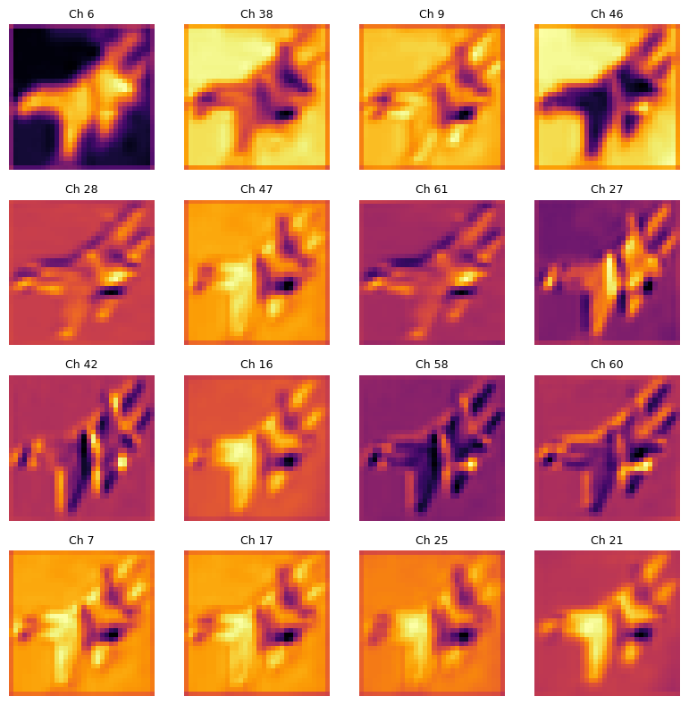

# Explainable-CNN

## Overview

This repository contains the code for explainable CNN. We designed a 5-hidden layer CNN with batch normalization. We did not use max-pooling to maintain the size of the activation maps. As commonly used, ReLU() activation function was used to capture non-linearities in data.

## Architecture

The model architecture is as follows:

```
ExplainableCNN(
  (conv1): Conv2d(3, 64, kernel_size=(3, 3), stride=(1, 1), padding=(1, 1))
  (norm1): BatchNorm2d(64, eps=1e-05, momentum=0.1, affine=True, track_running_stats=True)
  (conv2): Conv2d(64, 128, kernel_size=(3, 3), stride=(1, 1), padding=(1, 1))
  (norm2): BatchNorm2d(128, eps=1e-05, momentum=0.1, affine=True, track_running_stats=True)
  (conv3): Conv2d(128, 256, kernel_size=(3, 3), stride=(1, 1), padding=(1, 1))
  (norm3): BatchNorm2d(256, eps=1e-05, momentum=0.1, affine=True, track_running_stats=True)
  (conv4): Conv2d(256, 128, kernel_size=(3, 3), stride=(1, 1), padding=(1, 1))
  (norm4): BatchNorm2d(128, eps=1e-05, momentum=0.1, affine=True, track_running_stats=True)
  (conv5): Conv2d(128, 64, kernel_size=(3, 3), stride=(1, 1), padding=(1, 1))
  (norm5): BatchNorm2d(64, eps=1e-05, momentum=0.1, affine=True, track_running_stats=True)
  (flatten): Flatten(start_dim=1, end_dim=-1)
  (linear): Linear(in_features=65536, out_features=10, bias=True)
  (relu): ReLU()
)
```

## Hooks

Forward hooks were created for the layers 1 and 5 of the CNN. Forward hooks help execute a function `hooked` at a defined layer. We can detach the output of the hooked layer and perform operations on it.

## Visualization

Below is the image of the activation of the CNN at layer 1. As expected, the CNN was able to capture the outlines and textures at the lower layer.



## Usage of SAE's
